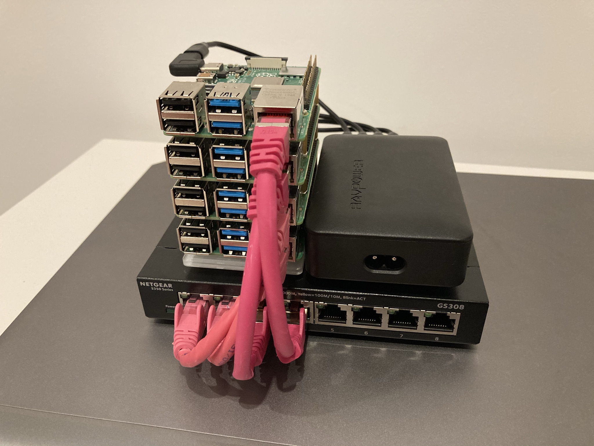

# Pi-HPC-cluster
Documentation for a Raspberry Pi cluster build for learning HPC admin and testing distributed applications

## Overview
This is an educational project to build a 'toy' HPC (high performance computing) cluster from Raspberry Pi Model 4B's.

This documentation will be updated as the project progresses.

## Hardware and components
The following is the list of components used in this build, with links to U.K. suppliers (mostly Amazon and The Pi Hut). Credit to Jeff Geerling's [Pi Dramble](http://www.pidramble.com/) project for much of the inspiration for hardware components.

Most components were readily available, but if you aren't cutting and terminating your own ethernet cables, the short ones can be tricky to get hold of. 

Note that this build is not using Power over Ethernet (PoE). You can choose to purchase a [PoE HAT](https://thepihut.com/products/raspberry-pi-power-over-ethernet-poe-hat) for each Pi and use a (more expensive) PoE ethernet switch. You can then be free of the USB-C cables and USB charger. This may or may not be more expensive, depending on the prices of different components at time of purchase.

|                                   Item                                                          |   Qty  |  Price (each)  |  Notes  |
|  -------------------------------------------------------------------------------------------    |   ---  |  -----  |  -----  |
| [Raspberry Pi Model 4B (4GB)](https://thepihut.com/products/raspberry-pi-4-model-b)             |    4   |   £54   |  Older Pi's may not have gigabit ethernet, and will use micro-USB for power. This build is not suitable for compute modules |
| [Gigabit ethernet switch (8 ports, unmanaged)](https://www.amazon.co.uk/gp/product/B07PWHGQSS/) |    1   |   £22   |  Make sure it's a gigabit switch. If you are using 3 Pi's then you can purchase a 4-port switch, but then won't have the surface area to stick down both the Pi stack and power brick |
| [12A 6-port USB charger](https://www.amazon.co.uk/gp/product/B07MFPN87Y/)                       |    1   |   £20   |  Very important to have at least 2.4A @ 5V available per port (3A @ 5V is recommended for Model 4B, but 2.4A is fine for headless use with no peripherals) |
| [Cat 5e/6 15cm ethernet cables](https://www.amazon.co.uk/gp/product/B01J2CJXTA)                 |    4   |   £3    |  Can be very stiff and not always true to the advertised length. Make your own for guarantee! |
| [USB-A to USB-C 0.7ft charging cables](https://www.amazon.co.uk/gp/product/B0744J4BYY)          |    4   |   £3.50 |  Depending on how you arrange the components you may need longer cables |
| [SanDisk Extreme 32GB microSD cards](https://www.amazon.co.uk/gp/product/B06XWMQ81P)            |    4   |   £8    |  Any good quality 16/32GB card with UHS speed class 3 will do |
| [M2.5 brass standoff set](https://www.amazon.co.uk/gp/product/B07PDVXVZ5)                       |    1   |   £10   |  For securing the Pi's together. Alternatively purhcase a Raspberry Pi cluster case |
| [(optional) 90 degree USB-C to USB-C adapter](https://www.amazon.co.uk/gp/product/B071XHCW5W)   |    4   |   £3.50 |  Helped to make the USB-C charging cables reach the port without stretching too far |
| [(optional) Acryllic baseplate for Raspberry pi](https://shop.rasp.io/products/raspio-pibase-backplate-for-raspberry-pi-model-b) | 1 | £3.50 | Provides a flush surface for the bottom of your Pi stack
| [(optional) Command medium picture hanging strips](https://www.amazon.co.uk/gp/product/B00LW1APOC/) | 1 | £7 | A clean, reversible way of sticking the Pi stack and power brick to the ethernet switch. Not necessarily the prettiest, but does the job and can easily be undone |
| | TOTAL | £350.5

Here is a photo of the final product for reference (ethernet connection from switch to router not shown, nor are the mains power cables for the switch and power brick.)

<!--  -->

## Change log
[05/01/2021] Added list of hardware and components.

